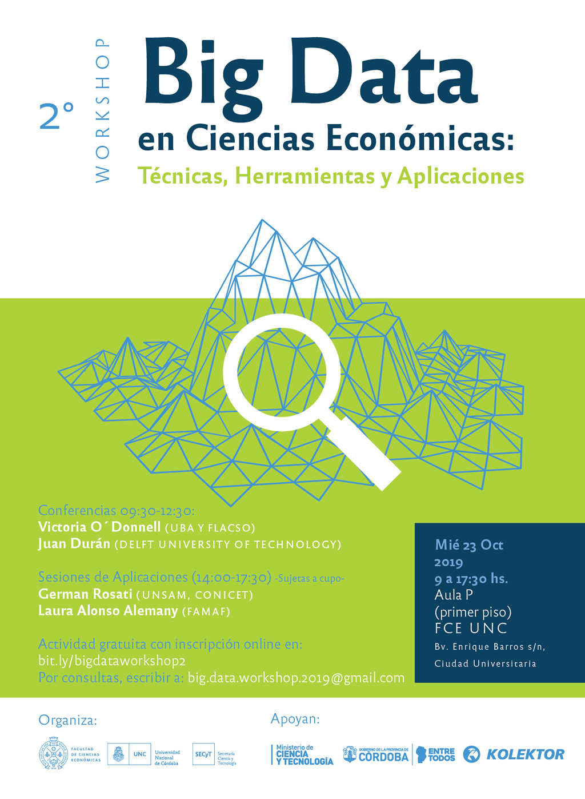

[](http://www.eco.unc.edu.ar/noticia-principal/2-workshop-sobre-big-data-en-ciencias-economicas)

[Germán Rosati](gefero.github.io)

# Presentación
El objetivo de este taller es brindar una primera aproximación a algunos conceptos fundamentales de Machine Learning: hiperparámetros, sesgo-varianza, flujo de trabajo, error de generalización, serán algunos de los conceptos a trabajar.
A su vez, se propone como caso de estudio la construcción de un imputador de ingresos para la Encuesta Permanente de Hogares.


# Contenidos y materiales
Pueden descargarse la totalidad de los materiales del repositorio para trabajar en un único archivo .zip

[](REPO_ML_workshop.zip)

# Librería a utilizar
El taller se desarrollará en R y se hará un uso extensivo de las siguientes librerías:

- `tidyverse`
- `caret`

Pueden instalarse utilizando las instrucciones:

```{r}
install.packages('tidyverse')  
install.packages('caret') 
```

# Instructivo de instalación
Ante cualquier duda pueden consultar el [instructivo de instalación](https://docs.google.com/document/d/1QOo8NsT1cZDJCID3qPvryc6Wl_9oMHxsY5B_CbWBEdg/edit)

# Notebook y código
- [Explicación y práctica - Notebook](notebook/ml_imputation_notebook.nb.html)
- [Explicación y práctica - RCode](scripts/ml_imputation_script.R)

